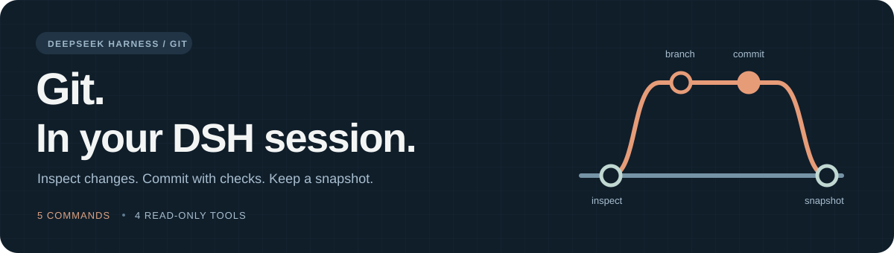

# dsh-git-plugin

English · [简体中文](README_ZH.md)

<p align="center">
  
</p>

<p align="center">
  <a href="https://www.npmjs.com/package/dsh-git-plugin"></a>
  <a href="https://github.com/MashedPotato817/dsh-git-plugin/actions/workflows/ci.yml"></a>
  <a href="https://www.npmjs.com/package/dsh-git-plugin"></a>
  <a href="./LICENSE"></a>
</p>

<p align="center">
  <a href="#install">Install</a> · <a href="#use">Use</a> · <a href="#docs-and-feedback">Docs & feedback</a>
</p>

## Keep Git in your DSH session

Inspect changes, create branches, run pre-commit checks, and keep recoverable snapshots. **Web Git panel + 5 slash commands + 4 read-only model tools** give you and your agent the same view of the repository.

- **See the changes** — branch, working tree, staged / unstaged diff, and history.
- **Commit with checks** — branch and commit directly in your session.
- **Keep a snapshot** — stash current changes, then list or restore them.

Version: **0.4.0**. Verified host: **DSH 0.2.0-rc.2**. Requires Node.js ≥20 and Git ≥2.32. [Compatibility and validation](CONTRIBUTING.md#compatibility-and-validation).

## Install

Use your active profile; replace `web` as needed:

```bash
dsh plugin --profile web add dsh-git-plugin@0.4.0
```

New installations register the plugin automatically. Restart that profile's DSH process and refresh the browser when using Web.

Upgrading a manually enabled 0.2.0 profile? Follow the [migration steps](docs/marketplace-submission.md#从手工启用的-020-迁移) to avoid duplicate registration. [Fixed GitHub tag and source installation](CONTRIBUTING.md#other-installation-methods).

## Git in the Web sidebar

Open a repository workspace/session, expand the right sidebar and select **Git**. See branch/file states, switch between staged and unstaged diffs, and browse commit history/detail. Stage selected files or all changes, commit only the index, manage branches/stashes, and restore files with a retained backup. Every write opens a preview and requires your confirmation. [Panel guide](docs/web-panel.md).

<p align="center">
  
</p>

## Use

```text
/status
/diff
/branch feat/my-change
/commit feat: 完成一项修改
```

| Command | Purpose |
|---|---|
| `/status` | Current branch and working-tree status |
| `/diff` | Staged and unstaged change summaries |
| `/branch [<name>]` | List branches, or create and switch |
| `/commit [<message>]` | Show commit guidance, or run checks and commit |
| `/undo [list\|pop]` | Create, list, or restore stash snapshots |

The model can use `git-status`, `git-diff`, `git-log`, and `git-show`. For example:

> Check Git status, diff, and the last five commits. Explain what is staged and what to verify before committing.

**Commit scope:** the Web commit uses only staged changes. `/commit <message>` stages all changes in the target repository before committing. Check the scope first. Without a message it only shows guidance and changes.

**Snapshots:** `/undo` stashes working-tree changes, including untracked files. It does not revert commits. Restoring with `pop` may produce conflicts.

Need longer timeouts or a test hook? See [configuration](CONTRIBUTING.md#configuration).

## Docs and feedback

- [Contributing](CONTRIBUTING.md) · configuration, source installation, development and validation
- [CHANGELOG](CHANGELOG.md) · release changes
- [Issues](https://github.com/MashedPotato817/dsh-git-plugin/issues) · bugs and feature requests
- [Market submission](docs/marketplace-submission.md) · catalog progress (Chinese audit record)
- [Web panel](docs/web-panel.md) · development preview and validation
- [Maintenance instructions](AGENTS.md) · engineering constraints

Version 0.4.0 completes the Git operation panel requested in Issue #1. Market inclusion is tracked separately. Presentation inspired by [dsh-agent-teams](https://github.com/NanmiCoder/dsh-agent-teams); the SVG banner is original.

## License

[MIT](LICENSE)
