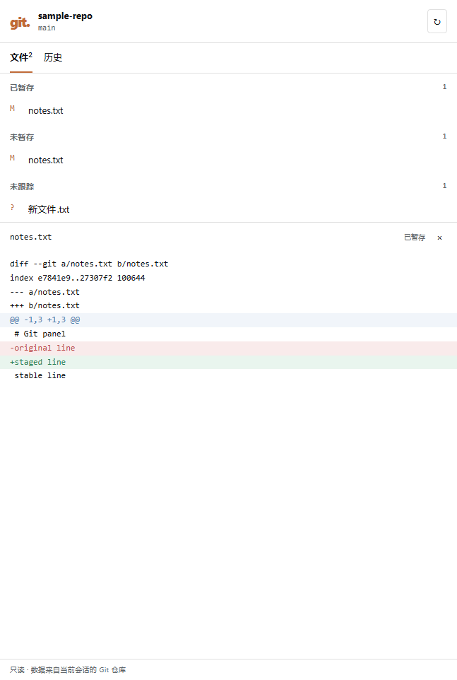

# DSH Web Git 面板

[English](web-panel.md) · 简体中文

**0.3.0** 实现了 [Issue #1](https://github.com/MashedPotato817/dsh-git-plugin/issues/1) 的首期只读面板。旧版 0.2.1 仅有命令／工具，不含面板；不要覆盖任何已发布包或移动旧标签。



截图来自独立 DSH 0.2.0-rc.2 Web profile 与临时 Git 仓库，不含私人仓库内容。

## 安装

```bash
dsh plugin --profile web add dsh-git-plugin@0.3.0
```

将 web 替换为实际 profile，重启对应 DSH 并刷新页面。原 bundle 配置保留；手工 insert 的 0.2.0 profile 先按迁移说明调整。

## 试用源码 checkout

使用独立 `DSH_HOME` 与 profile；不要替换日常配置。在当前开发 checkout 中执行：

```bash
npm ci
npm run build
npm run check
npm test
npm pack
```

用当前 shell 设置 `DSH_HOME` 为新的测试目录。下列路径替换为本机绝对路径，使用当前 DSH 安装对应的 CLI：

```bash
dsh --profile git-panel-test --from-default-profile web --dump-config
dsh plugin --profile git-panel-test add /absolute/path/dsh-git-plugin-0.3.0.tgz
```

在临时 Git 仓库内启动：

```bash
dsh --profile git-panel-test --no-open --port 17832
```

打开 DSH 输出的官方本地认证链接，选择仓库工作区／会话，打开右侧栏，点击 **Git**。安装或更换 tgz 后，重启该 profile 的 DSH 并刷新页面。查看面板不需要发起模型请求或配置 API Key。

## 可以查看的内容

- 分支、仓库与手动刷新。
- 冲突、已暂存、未暂存、未跟踪文件。同一文件两侧均有改动时，会分别出现，打开各自 diff。
- 以文本渲染的 diff，新增／删除行着色。未跟踪文件显示受限的当前内容预览，不伪造 HEAD diff；二进制、无法预览和截断均明确提示。
- 从 Git 对象读取的分页历史与提交详情，明确显示空仓库及 detached HEAD。

当前 UI 使用中文标签；文档双语不代表 UI 已有英文。首期不提供暂存、提交、切分支、恢复或 stash 按钮，现有斜杠命令行为保持。

## Host 契约

所有接口都是 DSH Connection 认证后的固定只读 `GET`，返回 JSON。失败结构为 `{ "error": { "code": "...", "message": "..." } }`。浏览器沿用当前 DSH base URL，包括挂载前缀。

| 路由 | 参数 | 成功结果 |
|---|---|---|
| `/api/git-panel/status` | `sessionId` | 根目录、分支、HEAD 与按 NUL 解析的 XY 文件状态 |
| `/api/git-panel/diff` | `sessionId`、仓库相对 `path`、`side=staged\|unstaged` | 文本及 binary/untracked/truncated 标记 |
| `/api/git-panel/log` | `sessionId`、可选 `count`（1–100，默认 30）、`skip`（0–10000，默认 0） | entries、skip、hasMore、truncated |
| `/api/git-panel/show` | `sessionId`、完整小写 40–64 位十六进制 `sha` | 提交文本、truncated |

Host 从运行中或持久化 Session 取得 cwd，并复用插件的唯一子仓库发现。未知 Session 拒绝读取；零个／多个子仓库不会擅自选定目标。请求不能传任意 cwd、root、argv，重复或未知参数拒绝。

路径穿越、绝对路径及 `.git` 路径拒绝；literal pathspec 防止 Git magic 展开。提交详情只接受验证后的 commit SHA，不接受任意选项形式 revision。Git 继续通过 `ctx.subprocess` 与纯 argv 执行，关闭 external diff/textconv 和可选 Git 锁，受输出字节及配置超时限制。状态超限返回错误，不把缺项列表显示成干净仓库。

DSH 0.2.0-rc.2 对准入的单一 operator 认证，并没有按租户划分 Session ACL。同一宿主内已准入 operator 知道其他 Session ID，不是另一套租户授权。插件在该宿主契约内增加未知 Session 与路径边界。

禁用插件会清理 tab、slot、样式和 Host 路由，取消请求并终止相应子进程。关闭／切换面板取消浏览器读取，旧响应不能覆盖新 Session／文件视图。CLI/headless 继续使用原命令和工具，无需 Web 服务。

## 复跑浏览器验收

可选[验收脚本](../scripts/verify-web-panel.mjs)需要独立工具目录内的 Playwright 与可用浏览器（本轮使用 Windows Edge），不进入 npm test/CI，不是插件运行时依赖。它会在指定测试 profile 内启用插件并执行两轮禁用／启用；不要指向日常 profile。

按 `--help` 创建三文件样本。从浏览器 DevTools 的面板 `status?sessionId=...` 请求读取该测试会话 ID（它不是凭据），传入独立服务日志，不传账号秘密：

```bash
node scripts/verify-web-panel.mjs --help
node scripts/verify-web-panel.mjs --dsh-log /test/server.log --session-id <fixture-session-id> --playwright-module /test/tools/node_modules/playwright --screenshots /test/screenshots
```

脚本只在内存中读取官方本地认证 URL，结束时关闭浏览器，不导出 browser storage。启动日志含临时认证链接，应留在本地；验收后由执行者停止测试服务并清理独立 profile。

## 验证与下一阶段

[验收记录](web-panel-validation.md) 区分测试层级、实际环境与未验证项。Windows 和 Linux 真实 Web 读取与在线启停已通过；单元／真实 Git 结果与浏览器证据分别记录。用户实际验收前，不标为“暂定稳定”。

P3 首先要解决无模型 open turn 时点击按钮的写审批契约，确定可恢复性并补针对性回归。Issue #1 保持开放，使用 `Refs #1`；只读首期不等于整个 GUI 需求完成。
